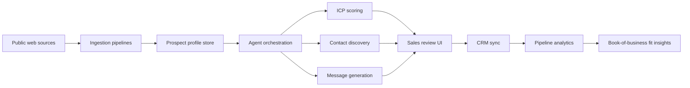

# Lead Generation Agentic System for Insurance Book of Business

## 1. Objective

Build a web-based agentic lead generation system that identifies, enriches, scores, and routes potential insurance-distribution customers that resemble:

- Synergy NMO
- Alera Group
- Applied Insurance Advisors

The system should align with the value proposition of E2E Unified Book of Business: unify fragmented insurance sales, producer, lead, commission, and carrier data into operational intelligence.

This means the lead-generation system should not only find companies that look similar by industry. It should prioritize prospects that are most likely to need:

- multi-carrier data unification
- producer or agency performance visibility
- lead-to-sale-to-revenue tracking
- commission and book-of-business analytics
- operational reporting across multiple offices, agencies, or lines of business

## 2. Target Customer Profile

### Primary Ideal Customer Profile

Mid-market to enterprise insurance distributors, broker groups, NMOs, FMOs, agencies, MGA-like organizations, and advisory firms with one or more of the following traits:

- operate across multiple product lines such as Medicare, health, employee benefits, P&C, life, wealth, retirement
- have distributed producers, sub-agencies, branch offices, partner agencies, or advisor networks
- work with multiple carriers and need to normalize fragmented carrier feeds
- have revenue leakage risk due to poor lead attribution, commission tracking, or policy reconciliation
- rely on spreadsheets, siloed CRMs, agency management systems, or manual reporting
- have a growth strategy based on recruiting producers, agency acquisition, or expanding regional distribution

### Example Segments from Reference Customers

#### Synergy-like

- insurance marketing organizations
- NMOs or FMOs
- agent networks with recruiting and lead distribution motions
- organizations emphasizing technology, agent enablement, carrier relationships, and in-house lead generation

#### Alera-like

- large multi-office brokerages
- firms offering employee benefits, P&C, retirement, and wealth services
- acquisitive platform businesses with fragmented operating systems across offices
- organizations that need unified reporting across practices and geographies

#### Applied-like

- independent agencies
- healthcare, Medicare, life, and group benefits agencies
- regional broker shops with quote intake, service teams, and lead capture on the web
- firms early in data maturity but with strong need for sales and policy visibility

## 3. Business Outcomes

The system should help sales and growth teams answer:

- Which companies are most likely to buy a Unified Book of Business platform?
- Which prospects have signals of data fragmentation, commission complexity, or multi-carrier sprawl?
- Which leads should be routed to enterprise sales versus SMB sales?
- What outreach angle should be used for each account?
- Which contacts within the account are likely buyers?

## 4. Solution Overview

Design the product as a multi-agent web application with five layers:

1. Data acquisition layer
2. Prospect intelligence layer
3. Agent orchestration layer
4. Human-in-the-loop workflow layer
5. CRM and analytics layer

### High-Level Flow



## 5. Recommended Agent Architecture

Use a coordinator agent with specialized task agents.

### 5.1 Orchestrator Agent

Responsibilities:

- receives a sourcing job such as "find 200 Alera-like prospects in the US"
- decomposes the work into research, enrichment, scoring, contact discovery, and outreach drafting
- applies workflow rules, confidence thresholds, and review gates
- logs reasoning artifacts and agent outputs for auditability

Inputs:

- ICP definition
- market segment filters
- territory filters
- existing account suppression list
- campaign goals

Outputs:

- ranked account list
- recommended personas
- explainable scoring reasons
- tailored messaging suggestions

### 5.2 Market Discovery Agent

Responsibilities:

- discover candidate companies from public web, directories, search results, LinkedIn-like sources, conference exhibitor lists, carrier partner lists, industry associations, M&A news, and state license registries
- classify company type such as brokerage, NMO, Medicare agency, employee benefits advisor, wealth and retirement practice, P&C broker, multi-line distributor

Signals to capture:

- number of offices or states served
- number of product lines
- mention of carriers or carrier partnerships
- producer recruitment language
- branch or acquisition footprint
- presence of quote forms, lead capture, or agent portals

### 5.3 Fit Scoring Agent

Responsibilities:

- score each account against a weighted ICP model
- estimate pain level for data unification, lead attribution, revenue reconciliation, producer management, and commission reporting
- assign segment tags and prioritize outreach plays

Example weighted features:

- multi-line offering: 15
- multi-office or distributed network: 15
- evidence of multiple carriers: 20
- producer recruiting or enablement motion: 10
- likely manual data operations: 10
- signs of acquisition roll-up or regional sprawl: 10
- clear lead generation motion: 10
- digital maturity strong enough to buy software: 10

### 5.4 Enrichment Agent

Responsibilities:

- normalize company profile
- append firmographics and technographics
- identify likely systems in use where possible
- infer sales operations maturity

Useful enrichment dimensions:

- employee count
- office count
- states served
- insurance lines offered
- keywords indicating carrier ecosystem complexity
- probable buyer personas
- likely annual premium or revenue band if inferable

### 5.5 Contact Discovery Agent

Responsibilities:

- identify likely buying committee members
- map titles to role hypotheses
- estimate buying influence

Target personas:

- COO
- VP Sales
- Revenue Operations leader
- Head of Agency Operations
- Distribution leader
- Carrier Relations lead
- Producer Management lead
- CIO or Director of Data
- Principal or Managing Partner for smaller agencies

### 5.6 Outreach Strategy Agent

Responsibilities:

- generate account-specific messaging
- choose primary pain-point angle
- draft email, call opener, and LinkedIn sequence
- suggest proof points based on detected business model

Example angles:

- unify lead-to-policy-to-commission visibility across carriers
- improve producer performance reporting across offices
- reduce revenue leakage from fragmented commission data
- centralize book-of-business insight after acquisitions
- improve lead source attribution and downstream revenue analytics

### 5.7 Compliance and Guardrail Agent

Responsibilities:

- remove unsupported claims from generated outputs
- ensure consent and outreach policies are respected
- tag data provenance and confidence
- enforce suppression, territory, and do-not-contact rules

## 6. Data Model

Your core entities should be:

- Account
- WebsiteSignal
- ProductLine
- CarrierSignal
- Geography
- Contact
- PersonaHypothesis
- FitScore
- BuyingTrigger
- OutreachDraft
- ReviewDecision
- CRMOpportunity

### Suggested Account Schema

```json
{
  "account_id": "uuid",
  "company_name": "Alera Group",
  "website": "https://aleragroup.com",
  "segment": ["brokerage", "employee_benefits", "property_casualty", "wealth"],
  "states_served": ["IL", "TX", "FL"],
  "office_count_estimate": 100,
  "distribution_model": ["multi-office", "producer-network"],
  "carrier_complexity_score": 0.82,
  "lead_generation_maturity_score": 0.63,
  "data_fragmentation_score": 0.88,
  "fit_score": 91,
  "fit_reasons": [
    "Multi-line brokerage",
    "Likely multi-carrier operations",
    "Distributed office footprint",
    "Strong need for unified reporting"
  ],
  "recommended_personas": [
    "COO",
    "Head of Operations",
    "Revenue Operations"
  ]
}
```

## 7. Data Sources

Use a blend of first-party, public, and commercial data.

### Public and Low-Cost Sources

- company websites
- contact pages and leadership pages
- state insurance license directories where allowed
- industry association directories
- conference speaker and exhibitor lists
- news and acquisition announcements
- job postings
- SEO metadata and technology fingerprints

### Commercial Sources

- Apollo, ZoomInfo, or Cognism for contacts and firmographics
- BuiltWith or similar for technographics
- Crunchbase for growth and funding context where relevant
- Similarweb for digital presence clues
- Clearbit-like enrichment if available

### Internal Sources

- CRM account history
- won and lost deals
- demo requests
- existing customer profiles
- implementation notes from Book of Business customers

## 8. Fit Scoring Logic

Use a hybrid scoring model.

### Rules-Based Layer First

Start with interpretable business rules. This is faster and safer than going straight to an LLM-only approach.

Example rules:

- If company offers 3 or more lines and operates in multiple states, increase fit.
- If company mentions carriers, recruiting, agents, or producer networks, increase fit for Synergy-like motion.
- If company has multiple offices, acquisitions, or practice areas, increase fit for Alera-like motion.
- If company offers Medicare, health, life, group coverage with quote forms and local offices, increase fit for Applied-like motion.

### ML or LLM-Assisted Layer Second

After you have labeled 300 to 1000 accounts, add:

- classification model for account type
- propensity-to-buy model
- persona prediction model
- next-best-message ranking model

### Explainability Requirement

Every score must include:

- top positive factors
- top missing factors
- confidence level
- source evidence links

## 9. Web Application Design

### Core Screens

#### 1. ICP Builder

Allows sales ops to define:

- target segments
- geographies
- product-line focus
- minimum fit threshold
- exclusion rules
- lookalike seed accounts

#### 2. Prospect Workspace

Shows:

- discovered accounts
- fit score
- explainability panel
- similar-to reference customer tag
- buying triggers
- recommended contacts

#### 3. Agent Review Console

Shows:

- agent outputs side by side
- evidence behind classification
- human approve, reject, edit actions
- feedback capture for model improvement

#### 4. Outreach Composer

Shows:

- tailored account narrative
- email sequence drafts
- call talking points
- objections likely to appear
- Book of Business value proposition matched to the account

#### 5. Pipeline Analytics

Shows:

- sourced accounts by segment
- conversion by fit band
- meeting rate by outreach angle
- win rate by pain-point hypothesis
- coverage gaps by geography and segment

## 10. Technology Stack Recommendation

If you want a practical and scalable build, use:

### Frontend

- Next.js
- TypeScript
- Tailwind CSS
- component library only if needed, keep workflow screens custom

### Backend

- Python FastAPI for agent and enrichment services
- Celery or a queue-based worker system for long-running jobs
- REST plus event-driven orchestration

### Storage

- PostgreSQL for transactional data
- pgvector if you need semantic retrieval over account evidence
- Redis for queues and caching
- object storage for raw crawl artifacts and documents

### AI and Orchestration

- LLM for reasoning, classification support, summarization, outreach drafting
- deterministic rules engine for eligibility and gating
- workflow orchestrator such as Temporal, LangGraph, or a queue-and-state-machine pattern

### Integrations

- CRM: Salesforce or HubSpot
- enrichment vendors
- email sequencing platform
- analytics warehouse if needed

## 11. Recommended Build Phases

### Phase 1: MVP

Goal: produce ranked accounts with human review.

Build:

- ICP builder
- website ingestion and parsing
- rules-based scoring
- account review dashboard
- CSV and CRM export

Do not build yet:

- fully autonomous outreach
- heavy multi-agent autonomy
- deep predictive ML

Success metric:

- sales team accepts 40 percent or more of suggested accounts as relevant

### Phase 2: Enrichment and Contacting

Build:

- commercial enrichment integrations
- contact discovery workflow
- persona ranking
- outreach draft generation
- CRM sync and suppression rules

Success metric:

- improvement in meeting-booked rate versus manual prospecting

### Phase 3: Learning System

Build:

- feedback loop from sales actions
- supervised propensity models
- segment-specific scoring models
- best-message recommendation

Success metric:

- fit score becomes predictive of pipeline conversion and win rate

## 12. Human-in-the-Loop Design

Do not make this fully autonomous at launch.

Keep humans in approval loops for:

- account qualification
- contact approval
- outreach approval
- CRM creation

Capture the reviewer action as training data:

- approved
- rejected
- wrong segment
- low confidence
- duplicate
- not enough evidence

## 13. Key Risks and Mitigations

### Risk: low-quality public data

Mitigation:

- store source evidence per claim
- require confidence scoring
- use enrichment vendors selectively for high-fit accounts

### Risk: hallucinated account assumptions

Mitigation:

- use rules-first scoring
- only allow the LLM to infer within bounded schemas
- show citations and extracted text behind every major assertion

### Risk: compliance and outreach abuse

Mitigation:

- add suppression lists
- enforce human review before first outreach
- maintain audit logs for generated content and source provenance

### Risk: unclear ROI

Mitigation:

- instrument acceptance rate, meeting rate, pipeline conversion, and win rate by sourced account cohort

## 14. How This Connects to Book of Business

Your strongest product story is not generic lead generation.

It is:

"We identify insurance organizations whose business model creates operational pain that Book of Business solves."

That means the system should anchor messaging and scoring around these product pains:

- fragmented carrier data
- lack of visibility from lead to policy to revenue
- weak producer performance tracking
- poor commission reconciliation
- limited operational insight across offices, products, and agencies

## 15. Suggested MVP User Story

"As a growth manager, I want to upload a seed list of known good customers and ask the system to find 500 similar insurance organizations, rank them by Book of Business fit, explain why they match, and prepare reviewed outreach for my sales team."

## 16. Recommended Next Build Sequence

1. Define the exact ICP taxonomy and scoring rubric.
2. Build the account and evidence schema.
3. Implement website ingestion and signal extraction.
4. Implement deterministic fit scoring.
5. Build the review UI.
6. Add CRM sync.
7. Add commercial enrichment.
8. Add contact discovery and outreach generation.
9. Add feedback-driven model refinement.

## 17. What to Build First in This Repo

If this repository is going to become the implementation, the first practical deliverables should be:

1. a product requirements document
2. an ICP taxonomy JSON schema
3. a prospect account schema
4. a scoring service prototype
5. a small web UI for account review

## 18. Recommendation

Start with a narrow vertical slice:

- one segment: insurance agencies and broker groups
- one data source set: company websites plus one enrichment provider
- one outcome: ranked accounts with explainable fit score

This will get you to a usable product quickly and give you real feedback before you invest in a fully autonomous agentic workflow.
